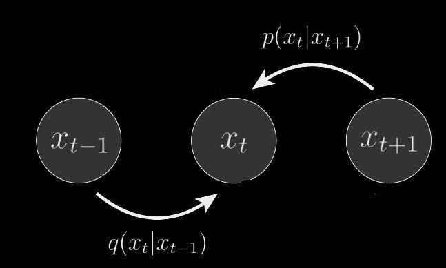
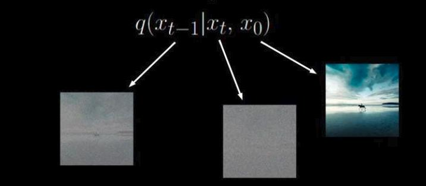
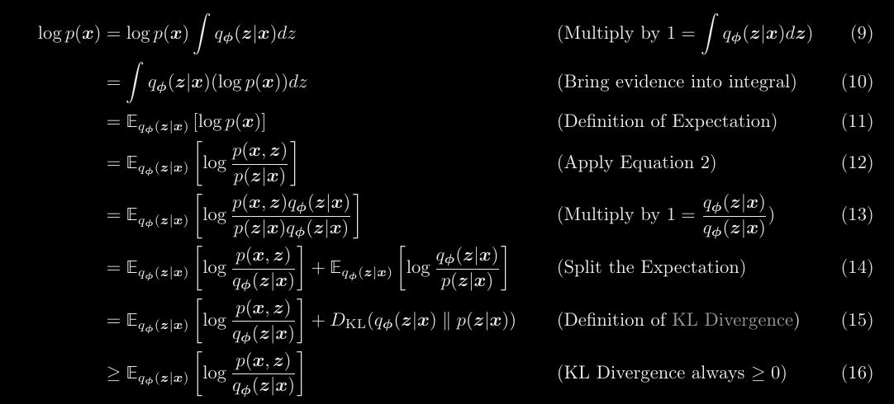
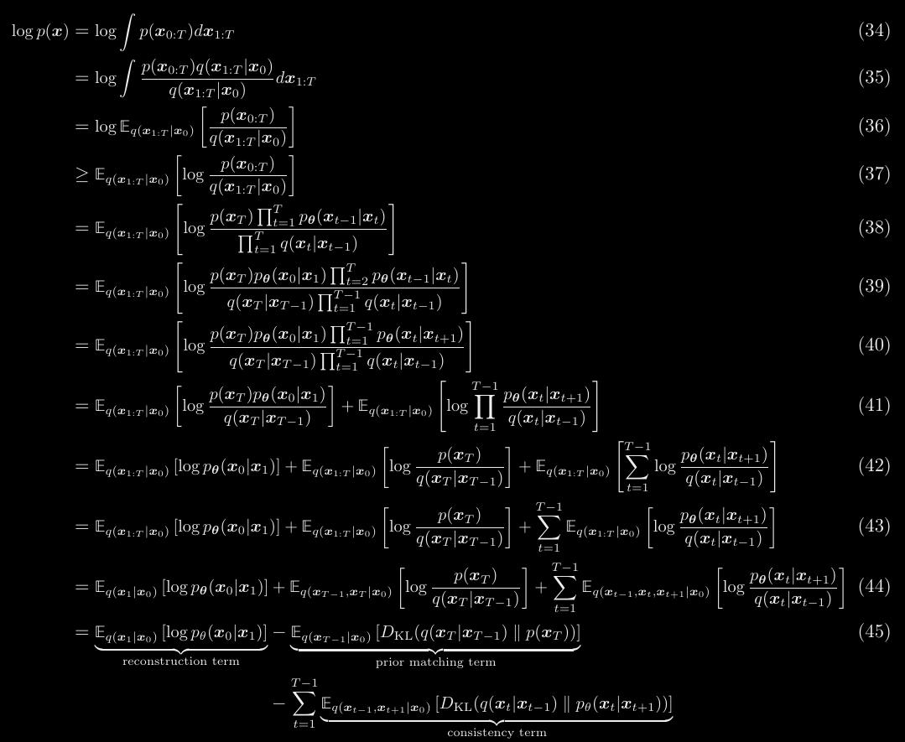
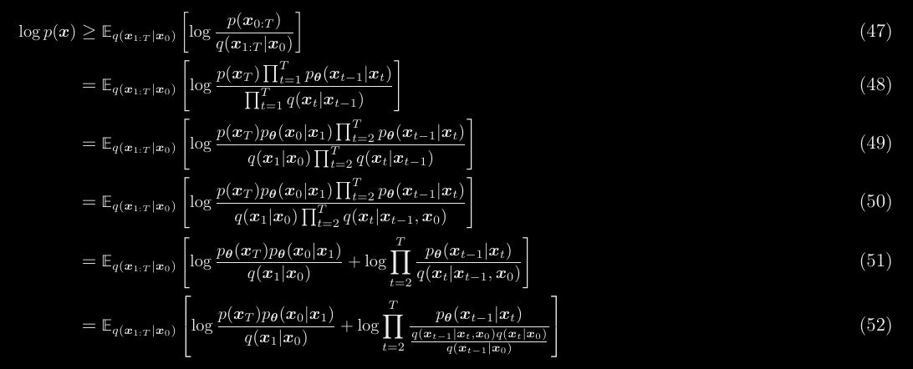
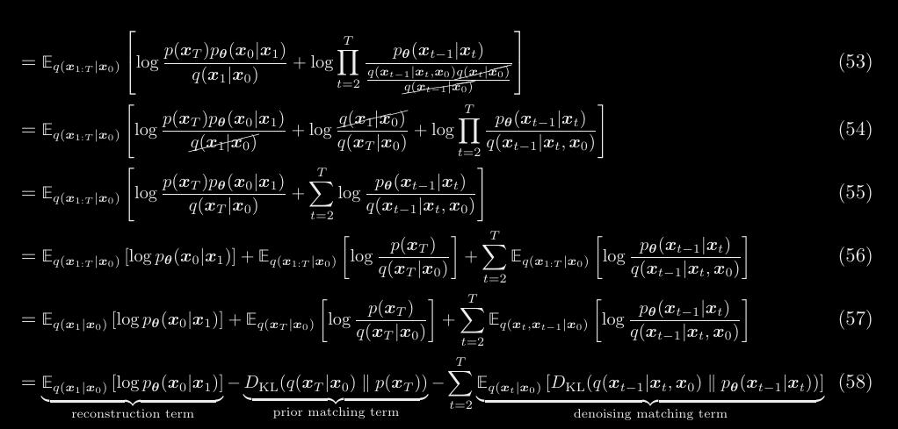

# Notes on Diffusion
Here are some notes while learning diffusion model.  

**1. Why is $p_{\theta}(x)$ intractable?**  

$$p_{\theta}(x) = \int_{z} p_{\theta}(x,z)d(z)
= \int_{z} p_{\theta}(x|z)p_{\theta}(z)d(z)$$  

To get $p_{\theta}(x)$, one has to marginalize out $z$. For every value of $z$, there is a different model of $p_{\theta}(x|z)$. Adding up each of these models will result in a mixture model[1](#myfootnote1). 

    

Image source: [Diffusion Models as a kind of VAE,Angus Turner](https://angusturner.github.io/assets/images/mixture.png) 
&nbsp; 

 
One could randomly draw $z^{(m)}$ from $p_{\theta}(z)$, then estimate $p_{\theta}(x)$ using Monte Carlo

$$p_{\theta}(x) \approx \frac{1}{M}\sum_{m=1}^{M}p_{\theta}(x|z^{(m)})$$

 But as there are many values of $z$, millions of samples will be needed to obtain reliable estimates. Variance is high when it comes to gradient estimation [2](#myfootnote1). Similiarly, it is not possible to get rid of this intractability using Bayes rule to get the posterior distribution $p_{\theta}(z|x)$, as $p_{\theta}(x)$ still shows up on the RHS

$$p_{\theta}(z|x)p_{\theta}(x) = p_{\theta}(x|z)p_{\theta}(z)$$
$$p_{\theta}(z|x) = \frac{p_{\theta}(x|z)p_{\theta}(z)}{p_{\theta}(x)}$$
$$p_{\theta}(z|x) = \frac{p_{\theta}(x,z)}{p_{\theta}(x)}$$

Hence, $p_{\theta}(x)$ is intractable. 

---

**2. How does ELBO sidestep this intractability?**   

Derivation of ELBO (evidence lower bound objective)[3](#myfootnote3):

$\log{p_{\theta}(x)}$  
  
$=\log{p_{\theta}(x)}\int_{z}q_{\lambda}(z|x)dz$  

$=\int_{z} \log{p_{\theta}(x)}  q_{\lambda}(z |x) dz$  
  
$= E_{q_{\lambda}(z |x)} \log{p_{\theta}(x)}$  
  
$= E_{q_{\lambda}(z |x)} \log\frac{{p_{\theta}(x,z)}}{{p_{\theta}(z |x)}}$  
  
$= E_{q_{\lambda}(z |x)} \log\frac{{p_{\theta}(x,z)}}{{p_{\theta}(z |x)}}$  
  
$= E_{q_{\lambda}(z |x)} \log\frac{{p_{\theta}(x,z)}}{{p_{\theta}(z |x)}} \frac{q_{\lambda}(z |x)}{q_{\lambda}(z |x)}$  

$= E_{q_{\lambda}(z |x)} \log\frac{{p_{\theta}(x,z)}}{q_{\lambda}(z |x)} + E_{q_{\lambda}(z |x)}\log\frac{q_{\lambda}(z |x)}{{p_{\theta}(z |x)}}$  

$= E_{q_{\lambda}(z |x)} \log\frac{{p_{\theta}(x,z)}}{q_{\lambda}(z |x)} + D_{KL}(q_{\lambda}(z |x) ||{p_{\theta}(z |x)})$  

It is impossible to minimize the second term $D_{KL}(q_{\lambda}(z |x) ||{p_{\theta}(z |x)})$ as ${p_{\theta}(z |x)}$ is an unknown ground truth. The true distribution of latent variables are never known in reality.

image source: https://www.thoughtco.com/the-allegory-of-the-cave-120330  

&nbsp; 

Instead, we maximize the first term $E_{q_{\lambda}(z |x)} \log\frac{{p_{\theta}(x,z)}}{q_{\lambda}(z |x)}$ by searching for the optimal $\lambda$. As LHS $\log{p_{\theta}(x)}$ is independant of $\lambda$ (and stays a constant), increasing the first term simultaneously decreases the second term. 

$$\log{p_{\theta}(x)}  \geq E_{q_{\lambda}(z |x)} \log\frac{{p_{\theta}(x,z)}}{q_{\lambda}(z |x)}\\
:= ELBO$$

  

Image source: https://deepgenerativemodels.github.io/notes/vae/

&nbsp; 

Instead of being intractable, the ELBO can be estimated using Monte Carlo as long as it is easy to sample from and obtain the distribution for $q_{\lambda}(z |x)$[2](#myfootnote2), 

$$\frac{1}{M}\sum_{m=1}^{M}\log\frac{{p_{\theta}(x,z^{(m)})}}{q_{\lambda}(z^{(m)} |x)}$$
 where $z^{(m)}$ ~ $q_{\lambda}(z |x)$

which is possible if $q_{\lambda}(z |x)$ is a encoder neural network or a closed-form forward process, as $x$ would be the input image and $z^{(m)}$ a sample from the output latent variable distribution.

-------
**3. How does adding a superfluous $x_{0}$ to $q(x_{t-1} |\ x_{t}$) reduce variance?**

For diffusion models, maximizing the ELBO will give you the following  

$$\log{p_{\theta}(x)}  \geq E_{q_{(x_{1}|x_{0})}}\log{p_{\theta}(x_{0}|x_{1})} - E_{q_{(x_{T}|x_{0})}} \log{\frac{q_{\lambda}(x_{T} |x_{T-1})}{p_{\theta}(x_{T})}} - \sum_{t=1}^{T-1}E_{q_{(x_{t-1}, x_{t+1}|x_{t})}}\log{\frac{q_{\lambda}(x_{t} |x_{t-1})}{p_{\theta}(x_{t} |x_{t+1})}}$$  
  

The first two terms are called the reconstruction term and prior matching term, but they are overwhelmed by the last term, which is called the consistency term. It is trying to make sure that the distribution of $x_{t}$ from both the forward process $q_{\lambda}(x_{t} |x_{t-1})$ and the reverse process $p_{\theta}(x_{t} |x_{t+1})$ are as similiar as it could be. 
  
However, it takes expectation over two random variables $x_{t}$ and $x_{t-1}$ at every time-step, as can be seen from the operator $E_{q_{(x_{t-1}, x_{t+1}|x_{t})}}$. This makes the variance of our Monte Carlo estimates higher than if we were to take expectation over one random variable. This is sub-optimal. As an example, a random variable $z_{1}$ has 1000 states (e.g Imagenet predictor), but a combination of two such random variables ( $z_{1},z_{2}$ ) would have 1000,000 states.  

  

&nbsp;

To reformulate the consistency term to take expectation over only one random variable, we introduce a superfluous term $x_{0}$. In a Markov process, 
$q(x_{t} |\ x_{t-1},x_{0}) = q(x_{t} |\ x_{t-1})$ since information from earlier than the previous step is not taken in consideration. By Bayes rule, 
$$q(x_{t} |\ x_{t-1},x_{0}) = \frac{q(x_{t-1} |\ x_{t},x_{0}) q(x_{t}|x_{0})}{q(x_{t-1} | x_{0})}$$ 
  
This allows us to reformulate the original equation to

$$\log{p_{\theta}(x)}  \geq E_{q_{(x_{1}|x_{0})}}\log{p_{\theta}(x_{0}|x_{1})} - E_{q_{(x_{T}|x_{0})}} \log{\frac{q_{\lambda}(x_{T} |x_{0})}{p_{\theta}(x_{T})}} - \sum_{t=2}^{T}E_{q_{(x_{t}|x_{0})}}\log{\frac{q_{\lambda}(x_{t-1} |x_{t},x_{0})}{p_{\theta}(x_{t-1} |x_{t})}}$$  

Comparing both equations, we can see that biggest change went to  the consistency term, going from

$$\sum_{t=1}^{T-1}E_{q_{(x_{t-1}, x_{t+1}|x_{t})}}\log{\frac{q_{\lambda}(x_{t} |x_{t-1})}{p_{\theta}(x_{t} |x_{t+1})}} \text{ to }  \sum_{t=2}^{T}E_{q_{(x_{t}|x_{0})}}\log{\frac{q_{\lambda}(x_{t-1} |x_{t},x_{0})}{p_{\theta}(x_{t-1} |x_{t})}}$$

In contrast to taking expectation over two random variables ( $E_{q_{(x_{t-1}, x_{t+1}|x_{t})}}$ ), the reformulation allows us to do so over one random variable ( $E_{q_{(x_{t}|x_{0})}}$ ). Additionally, instead of getting the neural network  to learn the reverse process $p_{\theta}(x_{t} |x_{t+1})$ from the forward process $q_{\lambda}(x_{t} |x_{t-1})$, we now "reverse" the forward process to get the posterior distribution $q_{\lambda}(x_{t-1} |x_{t},x_{0})$, so that the neural network learns the reverse process $p_{\theta}(x_{t} |x_{t+1})$ from the "reversed" forward process $q_{\lambda}(x_{t-1} |x_{t},x_{0})$. In practical terms, we are denoising a noisy image by one reverse time-step, but we do so by showing the original image $x_{0}$       

   
 
Image source: [Diffusion Models | Paper Explanation | Math Explained](https://youtu.be/HoKDTa5jHvg?t=1113)
&nbsp;

---
**Reference**

<a name="myfootnote1">1</a>: Adam Kosiorek, [What is wrong with VAEs?](https://akosiorek.github.io/ml/2018/03/14/what_is_wrong_with_vaes.html)  

<a name="myfootnote2">2</a>: Variational autoencoders, [deepgenerativemodels.io]( https://deepgenerativemodels.github.io/)

<a name="myfootnote3">3</a>: Calvin Luo,[Understanding Diffusion Models: A Unified Perspective,Eq (9-16) 
](https://arxiv.org/pdf/2208.11970.pdf)

4: Outlier, [Diffusion Models | Paper Explanation | Math Explained](https://youtu.be/HoKDTa5jHvg?t=1113)

---
**Appendix**  
Some math derivations from Calvin Luo,[Understanding Diffusion Models: A Unified Perspective 
](https://arxiv.org/pdf/2208.11970.pdf)

**ELBO derivation**

**Variational Diffusion derivation**

**Variational Diffusion (variance reduction) derivation**

